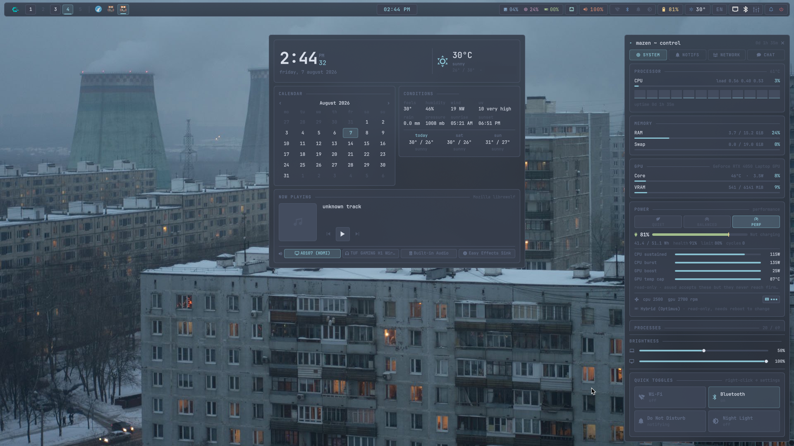
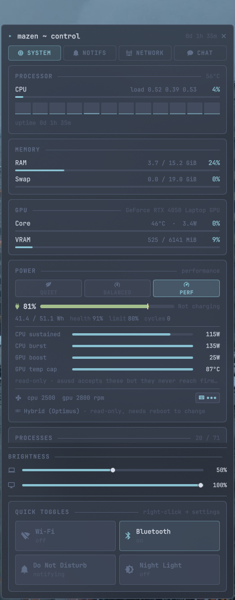

# dotfiles

My CachyOS (Arch) setup built around Hyprland, themed Nord. Hybrid Intel + NVIDIA
laptop driving a second 1080p144 monitor.

The bar and the side panel are the parts I actually care about — most of the work
in here is a hand-written Quickshell shell, not a theme drop.



<p align="center">
  
</p>

## what's in here

| | |
|---|---|
| **Compositor** | Hyprland — configured in **Lua**, not `.conf` |
| **Second compositor** | niri (scrollable tiling, same keybinds) |
| **Bar** | Waybar |
| **Shell / panel** | Quickshell (QML) — side panel, taskbar strip, dashboard, notifications |
| **Terminal** | Kitty |
| **Shell** | fish |
| **Launcher / menus** | Rofi |
| **Notifications** | Quickshell |
| **Editor** | Neovim (LazyVim) |
| **Fetch** | Fastfetch |
| **Theme** | Nord — accent `nord8` `#88C0D0` |
| **Font** | JetBrains Mono Nerd Font |
| **Cursor** | macOS (black), from `apple_cursor` |

## the panel

`.config/quickshell/panel/` is the bulk of this repo. It's one Quickshell process
that provides:

- **Side panel** (`SUPER+A`) — sticky, stays open until you dismiss it
  - live CPU / GPU / RAM / net with sparklines
  - process list with real per-process CPU (sampled from `/proc/[pid]/stat`
    deltas, not `ps`'s lifetime average) and per-process GPU memory
  - power profiles, battery, thermals — read-only for the firmware knobs
  - brightness sliders for **both** displays: sysfs backlight for the laptop,
    DDC/CI for the external monitor (debounced, because a DDC write is ~1s)
  - network, notification history, audio output switcher
  - an AI chat tab that shells out to the Claude Code CLI
- **Taskbar strip** overlaying the left of the bar — workspace pills + window list
- **Centre dashboard** (`SUPER+G`) — clock, calendar, weather, media with seek bar
- **Toasts** — the notification daemon

## keybinds

Everything below is `SUPER` unless noted.

| key | |
|---|---|
| `T` / `E` / `B` | terminal / files / browser |
| `Space` or `R` | rofi launcher |
| `Q` | close window |
| `F` / `V` | fullscreen / float |
| `1`–`0` | workspace (`SHIFT` to move window) |
| `A` | side panel |
| `G` | dashboard |
| `N` / `SHIFT+N` | notifications / do-not-disturb |
| `X` | power menu |
| `W` | wallpaper picker |
| `L` | lock (hyprlock) |
| `SHIFT+S` | region screenshot |
| `ALT+S` | delayed screenshot — for menus that vanish when you reach for the mouse |
| `SUPER + brightness keys` | external monitor brightness over DDC/CI |
| `Alt+Shift` | switch US ⇄ Arabic keyboard layout |

## installation

```bash
git clone https://github.com/ghatwary06/dotfiles.git
cd dotfiles
cp -r .config/* ~/.config/
cp .gtkrc-2.0 ~/
```

> Back up your existing configs first.

### fonts

Icons in Kitty, Waybar, Rofi, Fastfetch and the panel all come from
**JetBrains Mono Nerd Font**:

```bash
mkdir -p ~/.local/share/fonts/JetBrainsMonoNerdFont
curl -fLo /tmp/JetBrainsMono.tar.xz \
  https://github.com/ryanoasis/nerd-fonts/releases/latest/download/JetBrainsMono.tar.xz
tar -xf /tmp/JetBrainsMono.tar.xz -C ~/.local/share/fonts/JetBrainsMonoNerdFont
fc-cache -f
```

### what the panel shells out to

Missing tools make a widget go blank rather than break the shell:

`quickshell` `playerctl` `nvidia-smi` `ddcutil` `brightnessctl` `power-profiles-daemon`
`nmcli` `bluetoothctl` `wpctl` `grim` `slurp` `wl-clipboard`

DDC/CI needs the `i2c-dev` module loaded and your user in the `i2c` group,
otherwise the external-monitor brightness slider hides itself.

> **Heads up on the chat tab.** `panel/chat.sh` runs the Claude Code CLI with
> `--permission-mode auto` and full tool access, because a panel has nowhere to
> draw an approval dialog. On a single-user machine that's the same reach as a
> terminal you already have open — but don't put it on a shared box.

## notes

**Hyprland is configured in Lua.** `hyprland.lua` + `rice.lua` are the live
config; the matching `.conf` files are kept as a tested rollback.

**Multi-GPU.** `AQ_DRM_DEVICES` is resolved at launch from PCI paths rather than
hardcoded to `/dev/dri/cardN` — those numbers get reshuffled by kernel upgrades,
and a stale one means the external monitor silently never comes up.

`sync.sh` copies the live config on this machine back into the repo.
