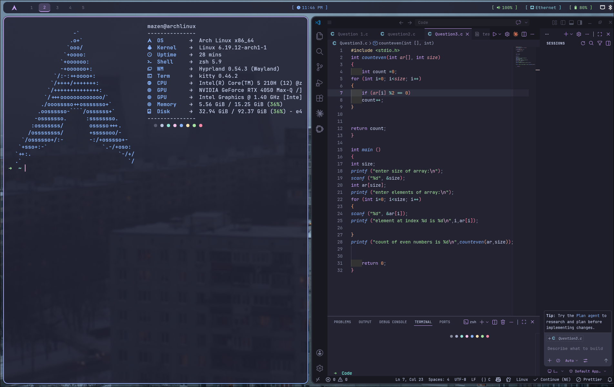

# dotfiles

My personal Arch Linux setup built around Hyprland. Took a while to get everything working the way I wanted, but here it is.

## what's in here

- **Window Manager** — Hyprland
- **Bar** — Waybar
- **Terminal** — Kitty
- **Shell** — Zsh + Oh My Zsh
- **Launcher** — Rofi
- **Notifications** — Dunst
- **Fetch** — Fastfetch
- **Theme** — Catppuccin Mocha
- **Font** — JetBrains Mono Nerd Font
- ## preview

## installation

\`\`\`bash
git clone https://github.com/ghatwary06/dotfiles.git
cd dotfiles
cp -r .config/* ~/.config/
\`\`\`

> Back up your existing configs before doing this.

## notes

NVIDIA setup included — configured for hybrid Intel + NVIDIA (RTX 4050). May need tweaking for other GPUs.
